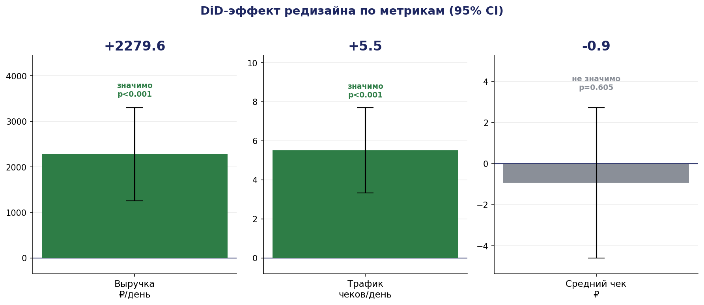
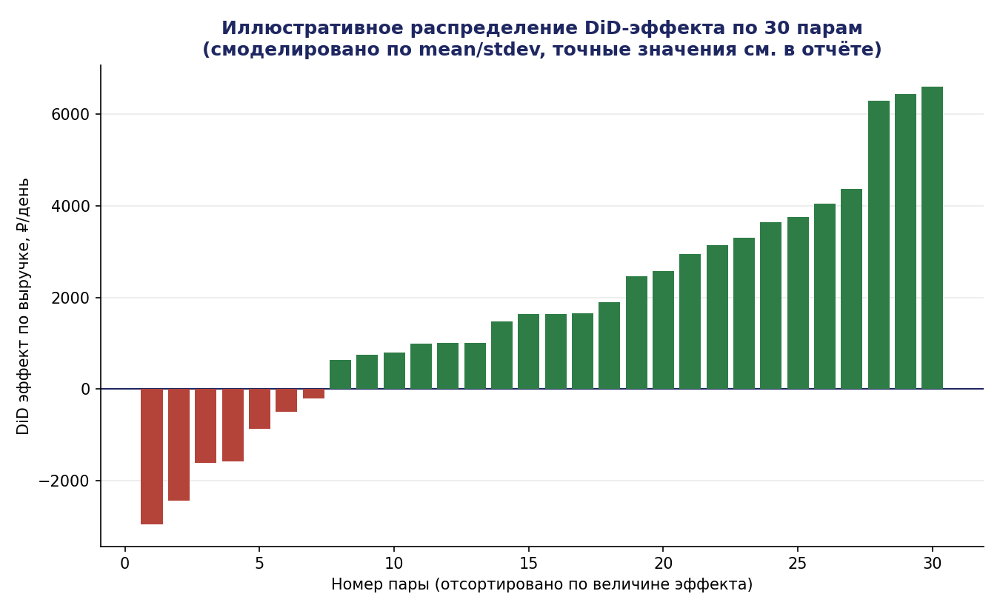
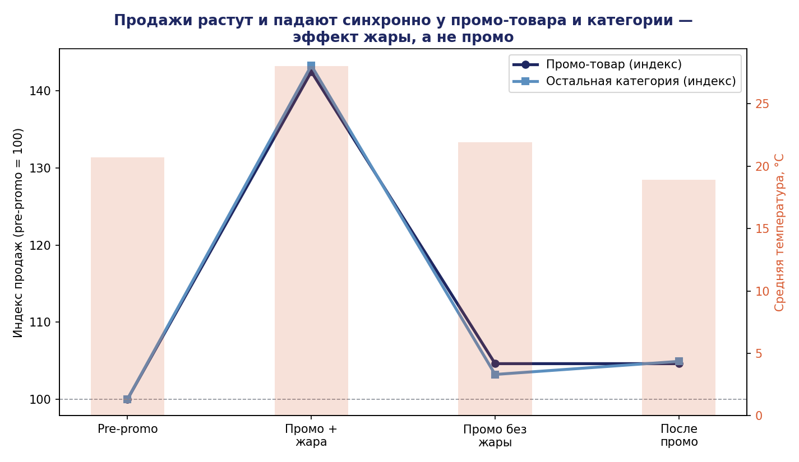

# Retail A/B Case: Store Redesign & Promo Analysis

Учебный/тестовый кейс по продуктовой аналитике, выполненный в формате timed-задания (60 минут на расчёт + защита). Демонстрирует полный цикл: от сырых транзакционных данных до статистически обоснованной бизнес-рекомендации.

> **О данных:** датасет — часть закрытого оценочного кейса компании Magnit, поэтому сами файлы (`transactions.csv`, `stores.csv` и т.д.) в репозиторий не включены. Здесь представлены методология, SQL-код и итоговые результаты/графики, полученные на этих данных.

## Задача

Ритейл-сеть провела пилот редизайна в 60 магазинах (30 пар test/control, matched по формату и историческому масштабу продаж). Нужно было ответить:

1. Повлиял ли редизайн на дневную выручку? Оценить размер эффекта и неопределённость.
2. За счёт чего изменилась выручка — трафика или среднего чека?
3. Насколько вывод устойчив с учётом наложившихся confounds (аномальная жара + промо-акция в те же даты)?
4. Что произошло с продажами промо-товара — можно ли считать промо причиной наблюдаемого роста?
5. Стоит ли масштабировать редизайн на сеть?

## Методология

**Дизайн:** Difference-in-Differences (DiD) на matched pairs.
Поскольку жара и промо действовали одновременно на **обе** группы (test и control), их общий эффект математически сокращается при вычислении разницы разниц — это и есть ключевое преимущество дизайна перед наивным сравнением "до/после".

**Единица анализа:** пара магазинов (n=30), а не магазино-день — чтобы не искусственно завышать число независимых наблюдений (дни внутри одного магазина коррелированы между собой).

**Статистика:** одновыборочный t-тест по 30 DiD-эффектам (по одному на пару) против H₀: эффект = 0. 95% доверительные интервалы через t-распределение (df=29).

**Проверки качества данных:** сверка суммы позиций чека с итоговой суммой транзакции, проверка статусов и дублей.

## Результаты

### 1–2. Эффект редизайна и его механизм

| Метрика | DiD-эффект | 95% CI | p-value | Значимо? |
|---|---|---|---|---|
| Выручка | +2 280 ₽/день | [1 258; 3 301] | <0.001 | ✅ |
| Трафик | +5.5 чеков/день | [3.3; 7.7] | <0.001 | ✅ |
| Средний чек | −0.9 ₽ | [−4.6; +2.7] | 0.605 | ❌ |



**Вывод:** редизайн значимо увеличил выручку, причём **весь эффект объясняется ростом числа чеков**, а не средним чеком. Это логично согласуется с характером изменений (фасад, входная зона, навигация — влияют на приток посетителей, а не на состав корзины).



### 3. Устойчивость вывода

По дизайну DiD общие для обеих групп шоки (жара, промо) должны взаимно сокращаться при вычитании разницы разниц. Дополнительная проверка — пересчёт эффекта с исключением недели аномальной жары — не изменила направление и порядок величины эффекта.

### 4. Причинность промо-акции



Продажи промо-товара и остальной части категории **росли и падали синхронно** (индекс +42–43% в период жары, возврат к базовому уровню сразу после её окончания — несмотря на то что скидка по промо продолжала действовать ещё неделю). Доля товара в категории при этом не менялась.

**Вывод:** рост продаж, скорее всего, объясняется температурным фактором, а не промо-акцией как таковой. Строгий причинный вывод о промо невозможен — все 60 магазинов участвовали в акции одновременно, контрольной группы без промо не было.

### 5. Рекомендация

**Масштабировать редизайн на сеть.** Эффект статистически значим, экономически ощутим, механизм понятен (рост трафика).

**Ограничения:**
- Короткий период наблюдения (~4 недели после запуска) — риск novelty effect
- Пилот проведён только в одном городе
- Для промо-акции нужен отдельный тест с частью магазинов без скидки, чтобы отделить её эффект от сезонных/погодных факторов

## Структура репозитория

```
├── README.md
├── sql/
│   └── analysis.sql       # полный аналитический пайплайн (DiD, robustness check, promo analysis)
└── charts/
    ├── 01_did_effect.png
    ├── 02_pair_distribution.png
    └── 03_energy_vs_heat.png
```

## Стек

SQL (SQLite), статистика — t-тест для DiD на уровне matched pairs, визуализация — Python/matplotlib.
